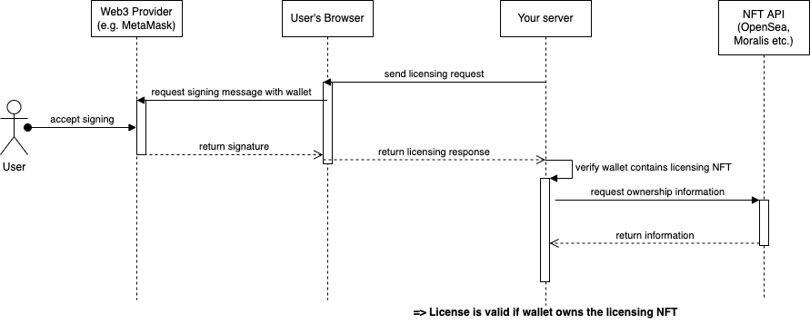

# NFTLicense

NFTLicense enables software licensing using NFTs and semi-non fungable tokens. Instead of using random product keys to verify the ownership of a license, NFTLicense will verify if the user's wallet contains your license NFT.

Using this technique, the licensing will be decentralised and independent from third-party licensing providers.

## Features

- Simple API
- Litte to no prior NFT/Web3 knowledge required
- Secure wallet and NFT ownership validation
- API-independent: The base class can be used with almost any NFT API, given a provider class has been created

## Installation

Simply install the `nftlicense` NPM package using:

- `npm i nftlicense` or
- `yarn add nftlicense` or
- `pnpm i nftlicense`

## Functionality

NFTLicense if split into two parts to enable secure license validation:

- `NFTLicense` runs on your trusted server to ultimately determine if the license is valid
- `NFTLicenseBrowser` runs in the user's browser to interact with the user's Web3 Provider (e.g. MetaMask browser extension)



The above image shows a flow chart of how NFTLicense verifies a valid license:

- Your server software requires the license to be verified (e.g. when the user opens the application)
- NFTLicense will create a challenge object to verify the ownership of the user's wallet
- You send the challenge object to the user's browser (e.g. using WebSockets)
- NFTLicenseBrowser is invoked with the challenge object to answer the server's challenge
- The user will get a MetaMask popup, prompting them to sign a message text
- NFTLicenseBrowser will return an answer object to your software
- Your software transferres the answer object back to your server (e.g. using WebSockets again)
- You call NFTLicense to verify the answer
- NFTLicense will verify that the answer object is a valid signature of the message text
- NFTLicense will call an NFT API (e.g. OpenSea's API) to verify that the wallet contains your licensing NFT
- NFTLicense returns to your software that the license is valid

If NFTLicense encounters problems at these steps (e.g. user doesn't sign message, signature is invalid, API returns NFT is not in wallet), the license will be regarded as invalid.

## Usage

A full example of a simple NFTLicense Server and frontend can be found in the `example/` folder. You can run the example by running `pnpm run example`.

### Create the NFT

As a first step, you'll need to create your licensing NFT.

- To publish using OpenSea, use [https://opensea.io/asset/create?enable_supply=true]
- The media uploaded is irrelevant, you probably want to set `Supply` higher to enable multiple people to purchase licenses
- NFTLicense is currently written for Ethereum contracts

After creation you'll need the NFT's address and token ID which can be found under "Details".

### Server

```JavaScript
import NFTLicense, { OpenSeaApi } from 'nftlicense';

// You will first need to create an API Provider that allows NFTLicense to verify NFT ownership
const apiProvider = new OpenSeaApi(

  // Address and Token ID of the NFT that should be regarded as the licensing NFT
  nftAddress,
  tokenId,

  // Optionally an OpenSea API Key.
  // This is highly recommended when using the OpenSea API as it is currently
  // very rate limited. The key can be requested on https://docs.opensea.io/reference/request-an-api-key
  MY_OPENSEA_API_KEY

);

// Next, create the licensing manager. Please note that the manager will store internal state so
// you should always use the same manager instance instead of creating multiple ones
const licenser = new NFTLicense(apiProvider);

// Application code to enable verifying the license for a user of your program
const verifyLicense = () => {

  // First, create a wallet challenge for getting the user's wallet and a signature
  const challenge = licenser.getChallenge();

  // Now send the challenge to the user's browser using your preferred method.
  // In this case, it will use a socket.io connection with a callback the user's
  // browser will send after completing the challenge.
  // Take a look at the browser usage further below to see the code on the other side
  socket.emit('license challenge', challenge, (answer) => {

    // We now got an answer from the user. We can simply pass it back to the licenser to let it
    // validate the rest for us
    licenser.validateLicenseWithChallenge(answer).then((isValid) => {

      // We now got our license verification!
      // If "isValid" is true, NFTLicense has confirmed that the user owns the wallet and the NFT
      console.log('Validated license:', isValid);

    });
  })
}
```

### Browser

```JavaScript
// Import the library
// Alternatively, you can import the script directly using
// <script src="/path/to/dist/NFTLicenseBrowser.js"></script>
// which will add the global NFTLicenseBrowser class to window
import { NFTLicenseBrowser } from 'nftlicense';

// Browser licenser doesn't require any additional information as that is handled
// completely on the server side
const licenser = new NFTLicenseBrowser();

// The server asks us to answer the challenge using our wallet
socket.on('license challenge', (challenge, callback) => {

  // Let the created licenser complete the challenge
  // This will show the user a MetaMask (or other Web3 provider) popup to sign the message
  licenser.completeChallenge(challenge).then((answer) => {

    // Simply relay the answer back to the server as all verification is done there
    callback(answer);
  });
});
```

## API

### NFTLicense

`import NFTLicense from 'nftlicense';`

- `new NFTLicense(api: Api, preamble: string = defaultPreamble)`

  Create a new NFTLicense server licensor.

  `api`: API Provider to use for verifying ownership

  `pramble` (optional): Text to prepend to the challenge message. This will be shown on the user's MetaMask popup. If not set, the preamble will be:

  ```
  Please sign this message to verify your ownership of the wallet.
  After verifying your ownership, we are able to verify that your wallet contains the necessary license NFT to use this software.
  ```

- `getChallenge(): object`

  Returns a new challenge object

- `validateLicenseWithChallenge(answer: object): Promise<boolean>`

  Validate an answer received from the user's browser

  `answer`: Answer object as returned by `NFTLicenseBrowser.completeChallenge`

### NFTLicenseBrowser

`import { NFTLicenseBrowser } from 'nftlicense';`

- `new NFTLicenseBrowser()`

  Create a new NFTLicenseBrowser browser-side licensor

- `completeChallenge(challenge: object): Promise<object>`

  Complete a challenge created by the server.

  This will return an answer object after the user has permitted signing

### OpenSeaApi

`import { OpenSeaApi } from 'nftlicense';`

- `new OpenSeaApi(contractAddress: string, tokenId: string, apiKey: string | null = null)`

  Create a new OpenSea API Provider

  `contractAddress`: Contract address for your NFT

  `tokenId`: Token ID for your NFT

  `apiKey`: API Key for OpenSea API (optional but highly recommended)

### MockApi

`import { MockApi } from 'nftlicense';`

Mock API to enable testing the system. This will simply always successfully validate any request without requesting any APIs

- `new MockApi()`

### Create your own API provider

An API provider implements requesting an NFT API to check if a wallet address contains the NFT. As most other complicated steps (getting wallet address, validating signature etc.) are handled by the library, adding new API providers is relatively simple.

API providers implement the API interface as defined in `src/api/Api.ts`. To comply with the interface, the provider only needs one function:

```TypeScript
hasValidLicense(address: string): Promise<boolean>;
```

This function show, given a wallet adress, return if the wallet contains a valid license.

Depending on the API used this may require additional information (e.g. the NFT's contract address and token ID) - this should be got using the class constructor instead.

For an example of a bare minimum API provider, take a look at the Mock provider at `src/api/MockApi.ts`, for a full example look at `src/api/OpenSea.ts`.

## Development

1. Clone the repository
2. Install dependencies using `pnpm install`

- Webpack can be started in watch mode using `pnpm run watch`
- Production build can be created using `pnpm run build`
- Example page (for testing) can be run by using `pnpm run example`

## License

This code is licensed under the MIT license
